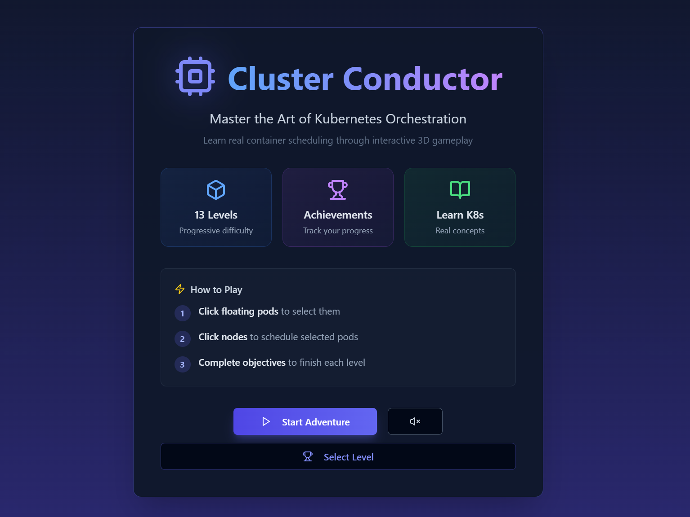
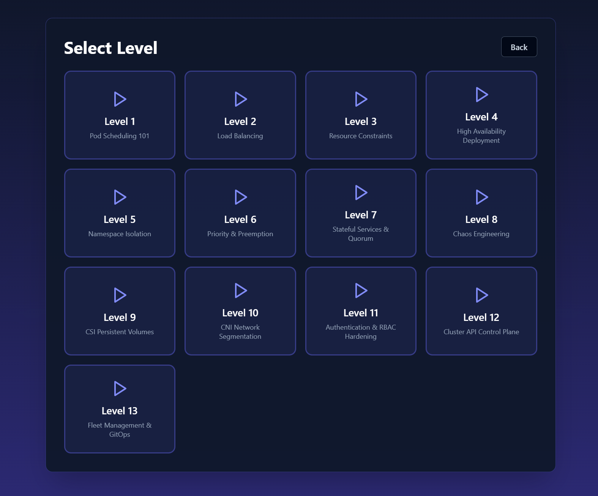
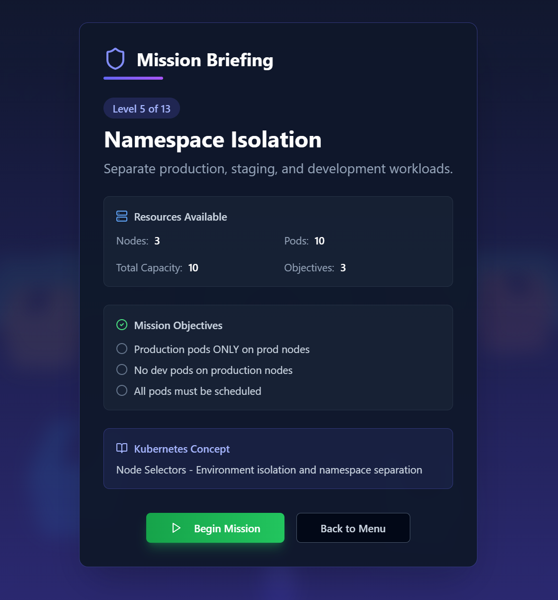
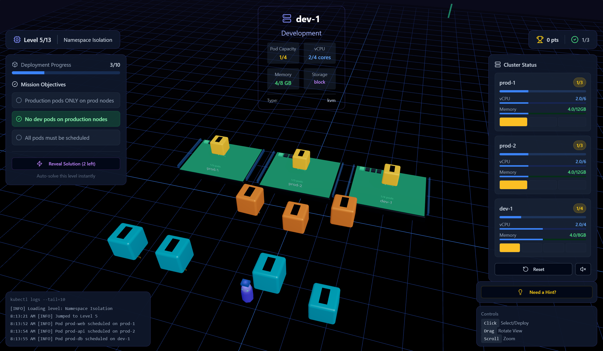
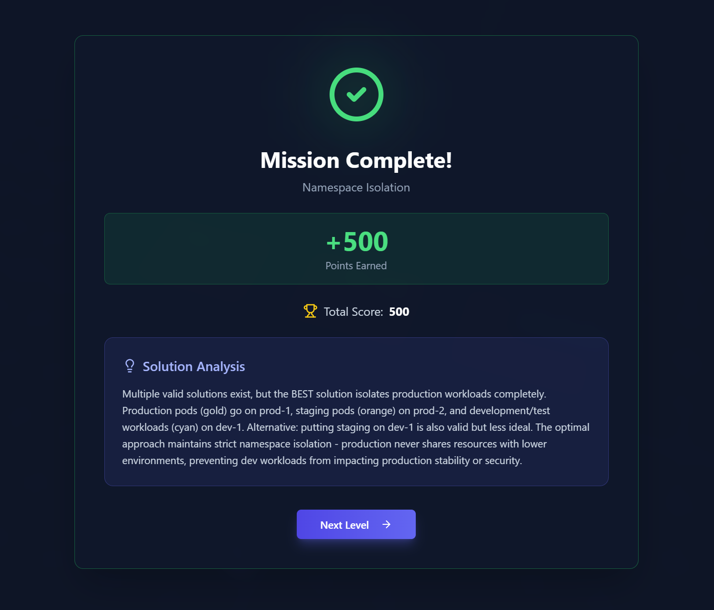

# Kube-Puzzle

Kube-Puzzle is a 3D learning game that teaches Kubernetes and AI infrastructure concepts through interactive, puzzle-based levels.

## Tech stack

- React + Vite
- Express server
- Three.js / React Three Fiber
- Drizzle ORM + Postgres

## Game overview

Kube-Puzzle presents a sequence of levels where each level simulates a Kubernetes-inspired scheduling or infrastructure scenario. You control the placement of "pods" onto "nodes" and complete objectives that mirror real-world cluster management constraints (capacity limits, redundancy, availability, etc.).

### Core loop

1. **Read the briefing**: Each level has objectives and hints that explain the target configuration.
2. **Move pods**: Place pods onto nodes to satisfy the objectives (e.g., distribute evenly, isolate services, respect capacity).
3. **Validate**: The game checks your configuration and updates progress.
4. **Advance**: Complete the level to unlock the next challenge.

### Game phases

The game uses distinct phases to control what appears on screen:

- **Menu**: The entry point where you can start or restart.
- **Briefing**: Level context, objectives, hints, and configuration details.
- **Playing**: The live 3D scene where you move pods and complete objectives.
- **Level complete**: Summary and progression to the next level.
- **Game complete**: Final state after the last level.

## Screenshots

### Main Menu


### Level Selection


### Mission Briefing


### Gameplay


### Mission Complete


## How to play

### Controls

- **WASD / Arrow keys**: Move the ball (player avatar).
- **Space**: Jump.
- **R**: Restart the current level.
- **M**: Toggle sound.

### Objectives and constraints

- Each level defines **nodes**, **pods**, and **objectives**.
- Objectives might include:
  - Distributing pods evenly across nodes.
  - Ensuring pods of the same type are separated.
  - Respecting node capacity limits.
- Some levels have multiple valid solutions.

### Tips

- Use the level hint if you're stuck.
- Think in Kubernetes terms: redundancy, isolation, and balanced scheduling.
- If you reveal a solution, study the configuration to understand the principles.

## Project structure

```
client/               # React UI and 3D scene
  src/
    components/       # Reusable UI components (buttons, cards, overlays)
    game/             # Three.js scene, UI overlays, and audio
    lib/              # Stores, utilities, and data structures
server/               # Express server entrypoint
shared/               # Shared types/utilities (if used across client/server)
script/               # Build scripts
```

### Key modules

- **Game state**: `client/src/lib/stores/useGame.tsx`
  - Defines level data, objectives, and the current game phase.
  - Implements actions like `start`, `restart`, `nextLevel`, and `revealSolution`.
- **Scene rendering**: `client/src/game/Scene.tsx`
  - Renders the 3D world and reacts to game phase changes.
- **UI overlays**: `client/src/game/UI.tsx`
  - Displays menus, briefings, HUD, and completion screens.
- **Audio**: `client/src/game/SoundManager.tsx`
  - Adjusts audio based on game state and user settings.

## How to expand the game

### Add a new level

1. Open `client/src/lib/stores/useGame.tsx`.
2. Find the `LEVELS` array and append a new `Level` object with:
   - `id`, `name`, and `description`.
   - `nodes`: each node needs `id`, `name`, `capacity`, and `position`.
   - `pods`: each pod needs `id`, `name`, `color`, `nodeId`, `status`, and `position`.
   - `objectives`: list of goal descriptions.
   - `targetConfiguration`: the intended mapping of pod IDs to node IDs (for validation).
   - Optional `hint` and `analysis` fields for guidance and learning notes.
3. Ensure any unique logic needed for the level (e.g., special solution reveal rules) is added alongside existing level logic.

### Add a new objective type

1. In `client/src/lib/stores/useGame.tsx`, extend objective checking logic in `checkObjectives`.
2. Update the level objectives to include the new rule.
3. Add any UI messaging in `client/src/game/UI.tsx` to reflect the new objective type.

### Add new UI panels or HUD elements

1. Create new components in `client/src/components/`.
2. Integrate them into `client/src/game/UI.tsx` for the appropriate game phase.
3. Style with Tailwind classes to match the existing look and feel.

### Add new audio cues

1. Add sound assets to the appropriate asset location (if present).
2. Wire them into `client/src/game/SoundManager.tsx`.
3. Trigger playback based on game phase or actions.

## Getting started

1. Install dependencies:
   ```bash
   npm install
   ```
2. Start the development server:
   ```bash
   npm run dev
   ```

## Scripts

- `npm run dev` – run the development server.
- `npm run build` – build the production bundle.
- `npm run start` – run the production server from `dist/`.
- `npm run check` – run TypeScript type-checking.
- `npm run lint` – run TypeScript type-checking without emitting files.

## Testing & linting

There are no automated test suites or lint configurations in this repository yet. Use `npm run check` or `npm run lint` to validate TypeScript types until dedicated test and lint tooling is added.
